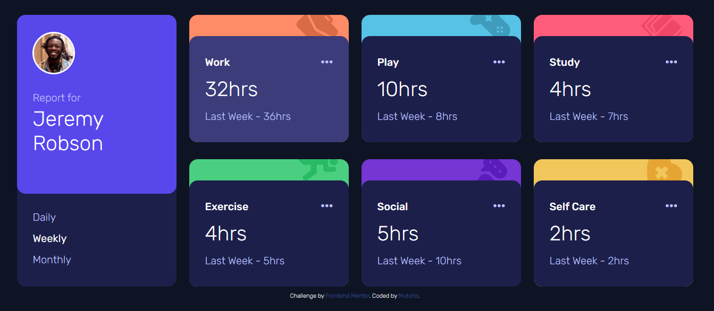

# Frontend Mentor - Time tracking dashboard solution

This is a solution to the [Time tracking dashboard challenge on Frontend Mentor](https://www.frontendmentor.io/challenges/time-tracking-dashboard-UIQ7167Jw). Frontend Mentor challenges help you improve your coding skills by building realistic projects. 

## Table of contents

- [Overview](#overview)
  - [The challenge](#the-challenge)
  - [Screenshot](#screenshot)
  - [Links](#links)
- [My process](#my-process)
  - [Built with](#built-with)
  - [Continued development](#continued-development)
  - [Useful resources](#useful-resources)
- [Author](#author)

## Overview

### The challenge

Users should be able to:

- View the optimal layout for the site depending on their device's screen size
- See hover states for all interactive elements on the page
- Switch between viewing Daily, Weekly, and Monthly stats

### Screenshot

### Links

- Solution URL: [Solution URL here](https://github.com/Mutohi-R/Time-Tracking)
- Live Site URL: [Live site URL here](https://voluble-seahorse-bc7b9a.netlify.app/)

## My process

### Built with

- Semantic HTML5 markup
- CSS custom properties
- Flexbox
- CSS Grid
- Mobile-first workflow

### Continued development

- CSS Grid
- Responsive layouts with less media queries

### Useful resources

- [Andy Bell CSS reset](https://andy-bell.co.uk/a-more-modern-css-reset/) 
- This helped me removing the default styles set on elements though I made a tiny modification to it.

## Author

- Frontend Mentor - [@Mutohi-R](https://www.frontendmentor.io/profile/Mutohi-R)
